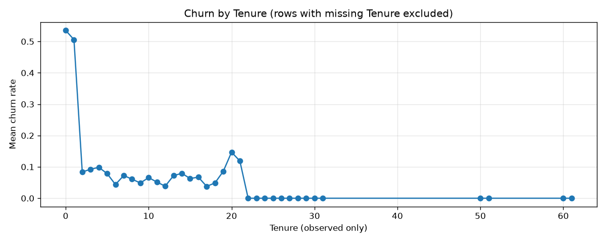

# Findings Memo: E-commerce Churn Data Summary

## 1. Executive overview

**Data scope:** Audited data/ecommerce_churn.csv with 5,630 rows and 20 columns for an e-commerce churn brief. Focus was dataset health, payment-mode label cleanup, and churn vs observed Tenure (no silent Tenure imputation).

**Artifact inventory:**
- outputs/churn_tenure.png
- outputs/data_summary_memo.md
- dry-run script executed via local .venv

## 2. Dataset health and schema audit

| Column Name | Inferred Type | Python Type | Missing Count (Abs) | Missing Ratio (%) | Health Status |
| :--- | :--- | :--- | ---: | ---: | :--- |
| Churn | Numeric | int64 | 0 | 0.00% | IS_CLEAN |
| CouponUsed | Numeric | float64 | 256 | 4.55% | HAS_NULLS |
| DaySinceLastOrder | Numeric | float64 | 307 | 5.45% | HAS_NULLS |
| HourSpendOnApp | Numeric | float64 | 255 | 4.53% | HAS_NULLS |
| OrderAmountHikeFromlastYear | Numeric | float64 | 265 | 4.71% | HAS_NULLS |
| OrderCount | Numeric | float64 | 258 | 4.58% | HAS_NULLS |
| PreferredPaymentMode | Categorical | str | 0 | 0.00% | SHOULD_REVIEW |
| Tenure | Numeric | float64 | 264 | 4.69% | SHOULD_REVIEW |
| WarehouseToHome | Numeric | float64 | 251 | 4.46% | HAS_NULLS |

**Checks:**
- Duplicate CustomerIDs: 0
- Overall churn rate: 16.84%
- Payment labels raw: Debit Card (2314), Credit Card (1501), E wallet (614), UPI (414), COD (365), CC (273), Cash on Delivery (149)
- Payment labels after cleanup: Debit Card (2314), Credit Card (1774), E-Wallet (614), Cash on Delivery (514), UPI (414)

## 3. Metric breakdown

Churn by canonical PreferredPaymentMode:

| PreferredPaymentMode | Count | Share of rows | Mean churn rate |
| :--- | ---: | ---: | ---: |
| Debit Card | 2314 | 41.10% | 15.38% |
| Credit Card | 1774 | 31.51% | 14.21% |
| E-Wallet | 614 | 10.91% | 22.80% |
| Cash on Delivery | 514 | 9.13% | 24.90% |
| UPI | 414 | 7.35% | 17.39% |

## 4. Visual evidence

Mean churn by Tenure using observed Tenure only (5,366 of 5,630 rows). Tenure missingness is 264 rows (4.69%); those rows are excluded from the chart, not imputed.

## 5. Takeaways and next steps

- Payment aliases mattered: CC and Credit Card were separate before cleanup and would have split the breakdown.
- Tenure has material missingness and should stay marked SHOULD_REVIEW before any modeling story that leans on tenure curves.
- Next: lock payment canonicalization in a shared transform, and decide an explicit Tenure imputation or missingness indicator policy before churn modeling.
